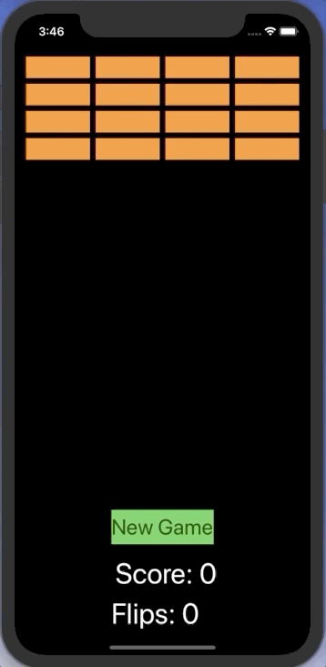

#  
# Concentration

### User Stories

The following is a mobile app created using Swift. It depicts the game known as Concentration or Matching Pairs. 

### Approach Taken

* Established a MVC architecture to split tasks into core and ui denominations
* Made use of structs to create objects with similar but not exact properties
* Linked storyboard elements via to a view controller that performed actions based on the model 

### Technologies used

* **Storyboard** To build IO components
* **UIKit** For UI component association in code
* **Swift** To serve as the groundwork for core and ui functionality

### Installation Instructions
* Run the `Concentration.xcodeproj` file in XCode
